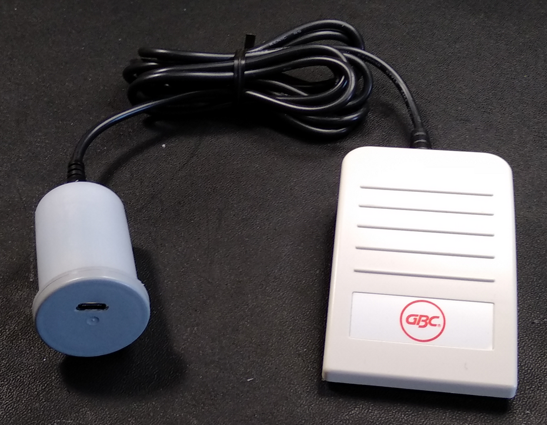
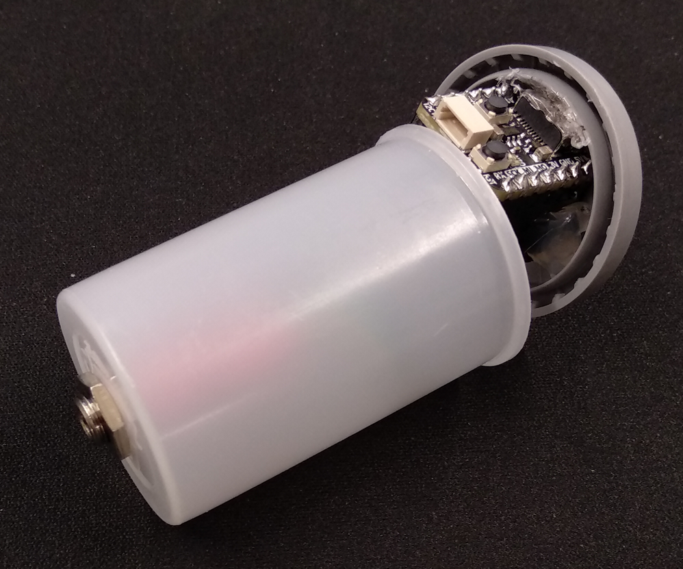

# macropedal

## 1 - Introduction and Construction

The *Macropedal* is based on an [Adafruit QT Py RP2040](https://www.adafruit.com/product/4900) and runs code very similar to that of my [Ultimate Adafruit Macropad](https://github.com/Fescron/Ultimate_Adafruit_MacroPad). It was initially developed to be able to execute macropad-like-functionality using a pedal, but due to its generic 4-pin 3.5mm headphone jack it can be connected to any switch(es) (via a [3.5mm 4-pin breakout plug](https://www.adafruit.com/product/2914)).

Because of the board's size a *35mm film canister* is a perfect fit for an enclosure. Inside it the [Adafruit QT Py RP2040](https://www.adafruit.com/product/4900) is connected to a female 4-pin 3.5mm headphone jack using the following pinout:

- Tip = `A0`
- Ring1 = `A1`
- Ring2 = `A2`
- Sleeve = `GND`

At startup the code detects at if a (mono) pedal is connected, which shorts *Ring1* and *Ring2* to ground. Different initialization code and sequences are activated depending on if the pedal is found or individual buttons are used.

 

## 2 - Code

All files and folders inside the [`CIRCUITPY`](CIRCUITPY/) folder are an exact copy of those on the board. [`Keycodes.txt`](CIRCUITPY/Keycodes.txt) serves as a *quick-reference* file for the keycodes. All of the code is placed in [`code.py`](CIRCUITPY/code.py). Some key variables are:

- `KEYBOARD_LAYOUT`: This is used to set the used keyboard-layout
  - `0` = US QWERTY
  - `1` = Belgian AZERTY
  - `2` = Modified Belgian AZERTY (numbers and characters on number-row swapped)
- `PEDAL_SHORT_PRESS`, `PEDAL_LONG_PRESS`, `PEDAL_SHORT_DOUBLE_PRESS` and `PEDAL_SHORT_LONG_PRESS`: If a pedal is found at boot, the keyboard sequences defined by these variables are executed upon certain pedal-presses
- `BUTTON_TIP` (and `BUTTON_RING1` and `BUTTON_RING2`, but these are currently not implemented): If no pedal is found, the keyboard sequences defined by these variables are executed upon certain button-presses
- `DEBOUNCER`: Select which functionality to use when no pedal is detected
  - `True`: Use `Debouncer()` (available properties: `value`, `fell`, `rose`, `current_duration`, `last_duration`)
  - `False`: Use `Button()` (available properties: `short_count`, `long_press`, `pressed`, `released`)
